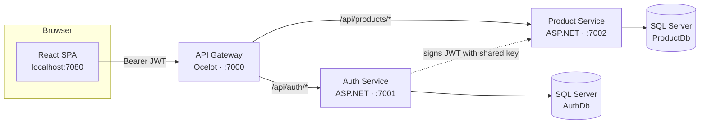

# Lab: Build a Microservices CRUD App with React, ASP.NET, SQL Server, an API Gateway, Docker & CI/CD

> A complete, hands-on tutorial. You will build a small e‑commerce style app where
> users **register / log in** (Authentication microservice) and manage a list of
> **products** (CRUD microservice), with an **Ocelot API Gateway** as the single entry
> point. The frontend is **React**, the backends are **ASP.NET Core Web APIs**, data
> lives in **SQL Server**, everything is packaged with **Docker**, built by a **CI/CD**
> pipeline (GitHub Actions) that **pushes images to Docker Hub**, and finally **deployed
> to Render** from those images.

**Estimated time:** 4–5 hours · **Level:** Intermediate

---

## 📦 Companion materials (in this repo)

| Resource | Path | Use it for |
|----------|------|-----------|
| 🔌 API tests (REST Client) | [`requests/auth.http`](requests/auth.http), [`requests/products.http`](requests/products.http) | Test the APIs from VS Code |
| 📮 Postman collection | [`requests/MicroserviceLab.postman_collection.json`](requests/MicroserviceLab.postman_collection.json) | Import into Postman (auto-saves the token) |
| 🧪 Unit tests | [`services/AuthService.Tests`](services/AuthService.Tests), [`services/ProductService.Tests`](services/ProductService.Tests) | xUnit tests run in CI (`dotnet test`) |
| ☁️ Render env files | [`deploy/`](deploy) | Copy-paste env vars for each Render service |
| 🖼️ Diagrams & figures | [`docs/images/`](docs/images) | Architecture, JWT flow, UI mockups, CI/CD |

> Follow this README top to bottom.

---

## 🔌 Ports used in this lab (all non-default, to avoid clashes)

| Component | URL | Note |
|-----------|-----|------|
| **API Gateway (Ocelot)** | http://localhost:7000 | **the only thing the browser/frontend calls** |
| Auth service | http://localhost:7001 | Swagger at `/swagger` (direct access for testing) |
| Product service | http://localhost:7002 | Swagger at `/swagger` (direct access for testing) |
| Frontend (nginx, Docker) | http://localhost:7080 | production build served by nginx |
| Frontend (Vite dev server) | http://localhost:7173 | `npm run dev` |
| SQL Server | localhost,14330 | host port (container port stays 1433) |

> The browser → **gateway (7000)** → Auth (7001) / Product (7002). You normally only
> open **7000** (via the frontend on 7080/7173). The 7001/7002 ports are just for
> poking each service's Swagger directly.

---

## ⚡ Quick start (just run it)

Want to see the finished app before studying the code? With **Docker Desktop running**:

```bash
docker compose up --build
```

Wait ~1–2 minutes (first run), then open **http://localhost:7080**, register a user, and
manage products. That's the whole stack — SQL Server + gateway + both APIs + React — in
one command.

To understand *how* it works and *how to deploy it yourself*, follow the parts below.

---

## Table of contents

1. [What you will build](#1-what-you-will-build)
2. [Learning objectives](#2-learning-objectives)
3. [Prerequisites & tools](#3-prerequisites--tools)
4. [Architecture overview](#4-architecture-overview)
5. [Project structure](#5-project-structure)
6. [Part A — Run SQL Server locally](#6-part-a--run-sql-server-locally)
7. [Part B — The Authentication service (ASP.NET)](#7-part-b--the-authentication-service-aspnet)
8. [Part C — The Product CRUD service (ASP.NET)](#8-part-c--the-product-crud-service-aspnet)
9. [Part D — The API Gateway (Ocelot)](#9-part-d--the-api-gateway-ocelot)
10. [Part E — The React frontend](#10-part-e--the-react-frontend)
11. [Part F — Run the full stack locally](#11-part-f--run-the-full-stack-locally)
12. [Part G — Dockerize everything (docker-compose)](#12-part-g--dockerize-everything-docker-compose)
13. [Part H — CI/CD: build & push images to Docker Hub](#13-part-h--cicd-build--push-images-to-docker-hub)
14. [Part I — Deploy to Render (from Docker Hub)](#14-part-i--deploy-to-render-from-docker-hub)
15. [Testing checklist](#15-testing-checklist)
16. [Troubleshooting](#16-troubleshooting)
17. [Key concepts glossary](#17-key-concepts-glossary)
18. [Submission checklist](#18-submission-checklist)

---

## 1. What you will build

A simple **Product Manager** web app:

- **Register / Login** — users create an account and sign in. On success they get a **JWT** (JSON Web Token).
- **Products CRUD** — logged-in users can **C**reate, **R**ead, **U**pdate and **D**elete products.
- The Product API is **protected**: it rejects requests that don't carry a valid JWT issued by the Auth service.
- An **API Gateway** sits in front of both services, so the frontend has a single URL to call.

This is a **microservices** design: independent backend services, each with its own
database, an API gateway, plus a separate frontend.

---

## 2. Learning objectives

By the end of this lab you can:

- Explain the **microservices** pattern, the **database-per-service** rule, and the **API gateway** pattern.
- Build **REST APIs** in **ASP.NET Core** with **Entity Framework Core** and **SQL Server**.
- Implement **JWT authentication** in one service and **validate** those tokens in another.
- Put an **Ocelot gateway** in front of the services and route requests to them.
- Build a **React** SPA that consumes the gateway and stores an auth token.
- Write **Dockerfiles** and orchestrate multiple containers with **docker-compose**.
- Create a **CI/CD pipeline** that **pushes images to Docker Hub**.
- **Deploy** the pre-built images to **Render**.

---

## 3. Prerequisites & tools

Install these before you start:

| Tool | Version | Check with |
|------|---------|------------|
| [.NET SDK](https://dotnet.microsoft.com/download) | 8.0+ | `dotnet --version` |
| [Node.js](https://nodejs.org) | 20+ | `node --version` |
| [Docker Desktop](https://www.docker.com/products/docker-desktop/) | latest | `docker --version` |
| [Git](https://git-scm.com/) | latest | `git --version` |
| A code editor | — | VS Code / Visual Studio / Rider |
| A [GitHub](https://github.com) account | — | for CI/CD |
| A [Docker Hub](https://hub.docker.com) account | — | to host the images |
| A [Render](https://render.com) account | — | for deployment (free) |

> 💡 **You don't need to install SQL Server manually** — we run it as a Docker container.

Optional but handy: the **REST Client** or **Thunder Client** VS Code extension, or **Postman**, to test APIs.

---

## 4. Architecture overview


<details>
<summary>Same diagram as Mermaid (renders on GitHub)</summary>


</details>

**How a request flows:**

1. The browser calls **only the gateway** (`:7000`).
2. The gateway (**Ocelot**) routes `/api/auth/*` to the Auth service and `/api/products/*`
   to the Product service, forwarding the `Authorization` header along.
3. On login, the **Auth Service** signs a JWT with a secret **signing key**.
4. For product requests, the **Product Service** validates that JWT with the **same key**
   (no call back to Auth needed) — *stateless* authentication, a core microservices idea.


> 🔑 **The single most important rule of this lab:** the `Jwt__Key`, `Jwt__Issuer`,
> and `Jwt__Audience` values **must be identical** in the Auth and Product services. If
> they differ, the Product service returns **401 Unauthorized**.

---

## 5. Project structure

```
Microservice_Docker_CICD/
├── README.md                     ← this tutorial
├── docker-compose.yml            ← runs the whole stack locally
├── render.yaml                   ← Render blueprint (deploys Docker Hub images)
├── .github/workflows/ci-cd.yml   ← CI/CD pipeline (build → push Docker Hub → deploy)
│
├── services/
│   ├── ApiGateway/               ← Ocelot API Gateway (single entry point)
│   │   ├── Program.cs
│   │   ├── ocelot.json           ← routes for local dev (localhost:7001/7002)
│   │   ├── ocelot.Docker.json    ← routes for docker (authservice/productservice)
│   │   ├── ocelot.Production.json ← routes for Render (public https URLs)
│   │   └── Dockerfile
│   │
│   ├── AuthService/              ← Microservice: Authentication (JWT)
│   │   ├── Controllers/AuthController.cs
│   │   ├── Data/AuthDbContext.cs
│   │   ├── DTOs/AuthDtos.cs
│   │   ├── Models/AppUser.cs
│   │   ├── Services/TokenService.cs, PasswordHasher.cs
│   │   ├── Program.cs · appsettings.json · Dockerfile
│   ├── AuthService.Tests/        ← xUnit tests (hashing, token)
│   │
│   ├── ProductService/           ← Microservice: Products CRUD
│   │   ├── Controllers/ProductsController.cs
│   │   ├── Data/ProductDbContext.cs
│   │   ├── DTOs/ProductDtos.cs
│   │   ├── Models/Product.cs
│   │   ├── Program.cs · appsettings.json · Dockerfile
│   └── ProductService.Tests/     ← xUnit tests (CRUD controller, in-memory DB)
│
├── deploy/                       ← Render env-var templates
├── requests/                     ← .http + Postman API tests (via the gateway)
├── docs/                         ← images/
│
└── frontend/                     ← React (Vite) single-page app
    ├── src/
    │   ├── pages/ (Login, Register, Products)
    │   ├── context/AuthContext.jsx
    │   ├── api.js                ← calls the gateway only
    │   └── App.jsx
    ├── Dockerfile · nginx.conf · package.json
```

> This repository already contains all the code. You can **read along** to
> understand each file, then **run** it. If you prefer to build from scratch,
> the sections below explain how each part was created and why.

---

## 6. Part A — Run SQL Server locally

We run Microsoft SQL Server 2022 as a Docker container. Note the **host port 14330**
(not the default 1433) to avoid clashing with any SQL Server already on your machine:

```bash
docker run -e "ACCEPT_EULA=Y" -e "MSSQL_SA_PASSWORD=Your_password123" -p 14330:1433 --name lab-sqlserver -d mcr.microsoft.com/mssql/server:2022-latest
```

Verify it's running:

```bash
docker ps
```

You should see `lab-sqlserver` in the list. SQL Server now listens on `localhost:14330`.

- **Username:** `sa`
- **Password:** `Your_password123` (SA password rules: 8+ chars, upper, lower, digit)

> ⚠️ In the full stack (Part G) `docker-compose` starts SQL Server **for you**, so you
> only need this manual step when running the services directly with `dotnet run`. If
> you'll go straight to docker-compose, you can skip ahead.
>
> ⚠️ **Before moving to Part G later**, remove this manual container — compose creates
> its own with the same name and port, and they will clash:
>
> ```bash
> docker rm -f lab-sqlserver
> ```

The databases (`AuthDb`, `ProductDb`) do **not** exist yet — each service creates its
own on first startup via `db.Database.EnsureCreated()` (see each `Program.cs`).

---

## 7. Part B — The Authentication service (ASP.NET)

Location: [`services/AuthService`](services/AuthService).

### 7.1 How it was created

```bash
dotnet new webapi -n AuthService -o services/AuthService --no-openapi
cd services/AuthService
dotnet add package Microsoft.EntityFrameworkCore.SqlServer
dotnet add package Microsoft.EntityFrameworkCore.Design
dotnet add package System.IdentityModel.Tokens.Jwt
dotnet add package Swashbuckle.AspNetCore
```

> Note: the Auth service only **issues** tokens, so it doesn't need the JwtBearer
> package — token **validation** (JwtBearer) belongs to the Product service.

### 7.2 The pieces

- **`Models/AppUser.cs`** — the user entity. We store a **password hash**, never the raw password.
- **`Data/AuthDbContext.cs`** — EF Core context; `Username` and `Email` are unique.
- **`DTOs/AuthDtos.cs`** — `RegisterDto`, `LoginDto`, and `AuthResponseDto`.
- **`Services/PasswordHasher.cs`** — PBKDF2 salted hashing (unit-tested).
- **`Services/TokenService.cs`** — builds and signs the **JWT**.
- **`Controllers/AuthController.cs`** — `POST /api/auth/register` and `POST /api/auth/login`.
- **`Program.cs`** — wires up EF Core, CORS, Swagger, and auto-creates the DB.

**Password security:** passwords are hashed with **PBKDF2** (100,000 iterations, random salt) and compared in constant time (see `PasswordHasher.cs`).

### 7.3 Run and test it

```bash
cd services/AuthService
dotnet run --urls http://localhost:7001
```

Open Swagger at **http://localhost:7001/swagger** and try:

1. `POST /api/auth/register` with:
   ```json
   { "username": "student", "email": "student@lab.com", "password": "secret123" }
   ```
2. You get back a `token`. 🎉 That's your JWT.

**Expected response (200 OK):**

```json
{
  "username": "student",
  "email": "student@lab.com",
  "token": "eyJhbGciOiJIUzI1NiIsInR5cCI6IkpXVCJ9...",
  "expiresAt": "2026-07-28T14:30:00Z"
}
```

> 🧪 Prefer testing outside the browser? Use [`requests/auth.http`](requests/auth.http)
> (VS Code REST Client) or the [Postman collection](requests/MicroserviceLab.postman_collection.json)
> — note those target the **gateway** (:7000, Part D), so start it first or edit the URL
> to :7001. Paste the `token` into [jwt.io](https://jwt.io) to see the claims inside it.

> ✅ **Checkpoint 1:** register + login both return a `token`. If you get **409**, that
> username/email is already taken — pick another.

---

## 8. Part C — The Product CRUD service (ASP.NET)

Location: [`services/ProductService`](services/ProductService).

### 8.1 How it was created

```bash
dotnet new webapi -n ProductService -o services/ProductService --no-openapi
cd services/ProductService
dotnet add package Microsoft.EntityFrameworkCore.SqlServer
dotnet add package Microsoft.EntityFrameworkCore.Design
dotnet add package Microsoft.AspNetCore.Authentication.JwtBearer
dotnet add package Swashbuckle.AspNetCore
```

### 8.2 The pieces

- **`Models/Product.cs`** — the product entity (`Name`, `Description`, `Price`, `Stock`).
- **`Data/ProductDbContext.cs`** — EF context; also **seeds** two sample products.
- **`Controllers/ProductsController.cs`** — full CRUD. Note the **`[Authorize]`** attribute: every endpoint requires a valid JWT.
- **`Program.cs`** — configures **JWT validation** with `AddJwtBearer(...)`. The
  `ValidIssuer`, `ValidAudience`, and `IssuerSigningKey` must match the Auth service.

### 8.3 Run and test it

Keep the Auth service running, and in a **second terminal**:

```bash
cd services/ProductService
dotnet run --urls http://localhost:7002
```

Open **http://localhost:7002/swagger**:

1. Call `GET /api/products` **without** a token → **401 Unauthorized**. Good — it's protected.
2. Click **Authorize** (top right), paste the JWT from Part B, and authorize.
3. Call `GET /api/products` again → **200 OK** with the two seeded products.
4. Try `POST`, `PUT`, `DELETE`. This is your CRUD in action.

**Expected `GET /api/products` response (200 OK, after Authorize):**

```json
[
  { "id": 2, "name": "Mechanical Keyboard", "description": "RGB, blue switches", "price": 59.90, "stock": 30, "createdAt": "2024-01-01T00:00:00" },
  { "id": 1, "name": "Wireless Mouse", "description": "2.4GHz ergonomic mouse", "price": 19.99, "stock": 50, "createdAt": "2024-01-01T00:00:00" }
]
```

> ✅ **Checkpoint 2 (the "aha" moment):** the same `GET /api/products` returns **401**
> without a token and **200** with a valid token. That proves the JWT issued by the Auth
> service is trusted by the Product service — the heart of this lab.

---

## 9. Part D — The API Gateway (Ocelot)

Location: [`services/ApiGateway`](services/ApiGateway).

An **API Gateway** is a single entry point that sits in front of your microservices and
**routes** each incoming request to the right one. Benefits: the frontend has one URL to
call, cross-cutting concerns (CORS, and later auth/rate-limiting/logging) live in one
place, and the internal services can stay private.

### 9.1 How it was created

```bash
dotnet new web -n ApiGateway -o services/ApiGateway
cd services/ApiGateway
dotnet add package Ocelot
```

### 9.2 The pieces

- **`Program.cs`** — loads the routing table, enables CORS (the browser talks only to the
  gateway), and calls `app.UseOcelot()`.
- **`ocelot.json`** — routes for **local dev** → downstream `localhost:7001` / `localhost:7002`.
- **`ocelot.Docker.json`** — routes for **docker-compose** → downstream `authservice:8080` / `productservice:8080`.
- **`ocelot.Production.json`** — routes for **Render** → downstream public `https` URLs.

`Program.cs` picks the right file based on `ASPNETCORE_ENVIRONMENT`
(`Development` → `ocelot.json`, `Docker` → `ocelot.Docker.json`, `Production` →
`ocelot.Production.json`). On Render you can also override the downstream hosts with
environment variables (no rebuild needed) — see Part I.

Each routing file maps upstream paths to downstream services, e.g.:

```json
{
  "DownstreamPathTemplate": "/api/auth/{everything}",
  "DownstreamScheme": "http",
  "DownstreamHostAndPorts": [ { "Host": "localhost", "Port": 7001 } ],
  "UpstreamPathTemplate": "/api/auth/{everything}",
  "UpstreamHttpMethod": [ "GET", "POST", "PUT", "DELETE" ]
}
```

> 🧠 The gateway just **forwards** requests (including the `Authorization` header). The
> Product service still validates the JWT itself — the gateway doesn't need the key.

### 9.3 Run and test it

With the Auth (7001) and Product (7002) services running, start the gateway in a **third terminal**:

```bash
cd services/ApiGateway
dotnet run --urls http://localhost:7000
```

Now hit everything through **port 7000**:

```bash
curl http://localhost:7000/health
curl -X POST http://localhost:7000/api/auth/login -H "Content-Type: application/json" -d "{\"username\":\"student\",\"password\":\"secret123\"}"
```

> ✅ **Checkpoint 3:** `POST http://localhost:7000/api/auth/login` returns a token, and
> `GET http://localhost:7000/api/products` (with the `Bearer` token) returns the products.
> The gateway is routing correctly. Test files: [`requests/auth.http`](requests/auth.http),
> [`requests/products.http`](requests/products.http), or the
> [Postman collection](requests/MicroserviceLab.postman_collection.json) (all point at :7000).

---

## 10. Part E — The React frontend

Location: [`frontend`](frontend).

### 10.1 How it was created

```bash
npm create vite@latest frontend -- --template react
cd frontend
npm install
npm install react-router-dom
```

### 10.2 The pieces

- **`src/api.js`** — a small `fetch` wrapper. It reads the **single** gateway URL from
  `VITE_API_URL` and automatically attaches the `Authorization: Bearer <token>` header for
  product calls. It calls `/api/auth/*` and `/api/products/*` on the gateway.
- **`src/context/AuthContext.jsx`** — stores the logged-in user + token in `localStorage`.
- **`src/pages/Login.jsx`, `Register.jsx`** — auth forms.
- **`src/pages/Products.jsx`** — the CRUD table + add/edit form.
- **`src/App.jsx`** — routing; `ProtectedRoute` redirects to `/login` if not authenticated.

### 10.3 Configure and run

The frontend reads its config from `frontend/.env`. That file is **gitignored** (standard
practice), so create it by copying the template:

```bash
cd frontend
cp .env.example .env
```

It contains just the gateway URL:

```bash
VITE_API_URL=http://localhost:7000
```

> If `.env` is missing, the app falls back to `http://localhost:7000` anyway (see
> `src/api.js`) — but create it so you know where the knob is.

Start the dev server (on port **7173**) — still inside `frontend/`:

```bash
npm install
npm run dev
```

Open **http://localhost:7173**. Register a user, then add/edit/delete products.

| Login / Register | Products (CRUD) |
|:---:|:---:|
|  |  |

> ✅ **Checkpoint 4:** you can register in the browser, get redirected into the app, see
> the two seeded products, and add/edit/delete rows that persist after a page refresh —
> all through the gateway.

> 🧠 **CORS note:** the browser talks only to the **gateway**, so CORS is configured on
> the **gateway** (its `AllowedOrigins` includes `http://localhost:7173` and
> `http://localhost:7080`). If you see a CORS error, that's the knob to check.

---

## 11. Part F — Run the full stack locally

To run **without Docker**, you need four terminals + SQL Server:

| Terminal | Command | URL |
|----------|---------|-----|
| SQL Server | `docker run ... -p 14330:1433 ... mssql/server` (Part A) | `localhost,14330` |
| Auth | `dotnet run --urls http://localhost:7001` | http://localhost:7001/swagger |
| Product | `dotnet run --urls http://localhost:7002` | http://localhost:7002/swagger |
| Gateway | `dotnet run --urls http://localhost:7000` | http://localhost:7000/health |
| Frontend | `npm run dev` | http://localhost:7173 |

Once you've confirmed it works, the easier path is one command with Docker → Part G.

### 11.1 Run the automated tests

The project ships with **xUnit** tests. They need **no database** (the Product tests use
an in-memory EF provider), so you can run them any time:

```bash
dotnet test services/AuthService.Tests/AuthService.Tests.csproj
dotnet test services/ProductService.Tests/ProductService.Tests.csproj
```

- **AuthService.Tests** — password hashing (hash ≠ plaintext, verify true/false, random salt) and JWT claims.
- **ProductService.Tests** — the CRUD controller: list seeded products, create, update, delete, not-found.

These same tests run automatically in CI (Part H).

---

## 12. Part G — Dockerize everything (docker-compose)

Each service has a **multi-stage Dockerfile**: a *build* stage compiles the app, and a
smaller *runtime* stage runs it. This keeps images small and fast.

- `services/ApiGateway/Dockerfile`, `AuthService/Dockerfile`, `ProductService/Dockerfile` — .NET SDK → ASP.NET runtime.
- `frontend/Dockerfile` — Node builds the static bundle → **nginx** serves it.

The **`docker-compose.yml`** at the repo root ties it all together: SQL Server + gateway
+ both APIs + frontend, on one network, with the right environment variables.

### Run the whole app with one command

> ⚠️ **If you created the manual SQL Server container in Part A**, remove it first —
> it uses the same container name and port as the compose one:
>
> ```bash
> docker rm -f lab-sqlserver
> ```

From the repo root:

```bash
docker compose up --build
```

Wait for the images to build and SQL Server to become healthy (~1–2 min the first time). Then open:

- **Frontend:** http://localhost:7080
- **Gateway health:** http://localhost:7000/health
- **Auth Swagger:** http://localhost:7001/swagger
- **Product Swagger:** http://localhost:7002/swagger

Stop everything with `Ctrl+C`, then:

```bash
docker compose down
```

> 🔎 **Networking details worth understanding:**
> 1. Inside the compose network, services reach the DB at host **`sqlserver`** on its
>    internal port **1433** (that's why compose connection strings say `Server=sqlserver,1433`).
>    The host maps SQL to **14330**, used only when running with `dotnet run`.
> 2. The gateway runs with `ASPNETCORE_ENVIRONMENT=Docker`, so it loads
>    `ocelot.Docker.json` and routes to `authservice` / `productservice`.
> 3. The **browser** runs on your host, so the React bundle is built with
>    `VITE_API_URL=http://localhost:7000` (the gateway's published port), passed as a
>    Docker **build arg** in `docker-compose.yml`.
> 4. SQL Server's data lives in a named **volume** (`sqldata`), so your users and
>    products survive `docker compose down`. To wipe everything and start fresh:
>    `docker compose down -v`.

---

## 13. Part H — CI/CD: build & push images to Docker Hub

**CI/CD** = *Continuous Integration / Continuous Deployment*. Our proper flow is:
**push code → GitHub Actions builds & tests → builds Docker images → pushes them to
Docker Hub → Render pulls the images**. The pipeline lives in
[`.github/workflows/ci-cd.yml`](.github/workflows/ci-cd.yml).


It has five jobs:

1. **build-backend** — builds the gateway + both .NET services (matrix build).
2. **test-backend** — runs the xUnit tests.
3. **build-frontend** — installs deps & runs `npm run build`.
4. **docker-push** — builds all **four** images (gateway, auth, product, frontend) and, on
   push to `main`, **pushes them to Docker Hub** (tags `:latest` and the commit SHA).
5. **deploy** — on push to `main`, calls Render **Deploy Hooks** so Render pulls the new images.

### 13.1 Create the Docker Hub repositories

On [Docker Hub](https://hub.docker.com), create four **public** repositories (simplest for
a lab so Render can pull without credentials):

```
<your-dockerhub-username>/lab-gateway
<your-dockerhub-username>/lab-authservice
<your-dockerhub-username>/lab-productservice
<your-dockerhub-username>/lab-frontend
```

### 13.2 Add GitHub secrets & variables

Repo → **Settings → Secrets and variables → Actions**:

**Secrets:**

| Name | Value |
|------|-------|
| `DOCKERHUB_USERNAME` | your Docker Hub username |
| `DOCKERHUB_TOKEN` | a Docker Hub **access token** (Account Settings → Security) |
| `RENDER_DEPLOY_HOOK_GATEWAY` | *(added in Part I)* |
| `RENDER_DEPLOY_HOOK_AUTH` | *(added in Part I)* |
| `RENDER_DEPLOY_HOOK_PRODUCT` | *(added in Part I)* |
| `RENDER_DEPLOY_HOOK_FRONTEND` | *(added in Part I)* |

**Variables:**

| Name | Value |
|------|-------|
| `VITE_API_URL` | your deployed **gateway** URL, e.g. `https://lab-gateway.onrender.com` (bakes into the frontend image) |

### 13.3 Push the project to GitHub

```bash
cd Microservice_Docker_CICD
git init
git add .
git commit -m "Initial microservices lab with API gateway"
git branch -M main
git remote add origin https://github.com/<your-username>/<your-repo>.git
git push -u origin main
```

Open the **Actions** tab — the pipeline builds, tests, and (on `main`) pushes the four
images to Docker Hub. The `deploy` job needs the Render hooks (Part I); until then it
fails at that last step — expected.

> 🧪 On **pull requests**, the images are built to validate the Dockerfiles but **not**
> pushed. Pushes to `main` build **and** push.

---

## 14. Part I — Deploy to Render (from Docker Hub)

Render **pulls the pre-built images** from Docker Hub — it doesn't build from source.

### 14.1 The database (keeping SQL Server)

Render's free tier does **not** host SQL Server, so we host the database elsewhere and
give Render only the connection string. Recommended free option: **Azure SQL Database
(free offer)**.

1. Create a free Azure SQL Database (Azure Portal → *SQL databases* → *Create* → pick the
   **Free** service tier / free offer).
2. Allow public network access and add a firewall rule to permit Azure/other services.
3. Copy its **ADO.NET connection string**:
   ```
   Server=tcp:yourserver.database.windows.net,1433;Initial Catalog=labdb;User ID=sqladmin;Password=YOUR_PASSWORD;Encrypt=True;TrustServerCertificate=False;
   ```

> Prefer to stay 100% on Render's free tier? See
> [Appendix: deploying with PostgreSQL](#appendix-alternative-deploy-with-postgresql).

### 14.2 Deploy the Auth & Product services (from images)

For **each** service (Auth, then Product):

1. Render dashboard → **New → Web Service** → **Deploy an existing image**.
2. **Image URL:**
   - Auth → `docker.io/<your-dockerhub-username>/lab-authservice:latest`
   - Product → `docker.io/<your-dockerhub-username>/lab-productservice:latest`
   - (If your repo is private, add Docker Hub credentials when prompted.)
3. **Instance type:** Free.
4. **Environment variables** (or paste the templates in [`deploy/`](deploy) via
   **Environment → Add from .env**):

   | Key | Auth service | Product service |
   |-----|--------------|-----------------|
   | `ConnectionStrings__DefaultConnection` | your SQL Server conn string | your SQL Server conn string |
   | `Jwt__Key` | a long random secret (32+ chars) | **the exact same value** |
   | `Jwt__Issuer` | `MicroserviceLab` | `MicroserviceLab` |
   | `Jwt__Audience` | `MicroserviceLabClients` | `MicroserviceLabClients` |

5. Create it. Render gives each a public URL like `https://lab-authservice.onrender.com`.
   Verify `/<url>/health` returns `healthy`.

### 14.3 Deploy the API Gateway (from image)

1. Render dashboard → **New → Web Service** → **Deploy an existing image**.
2. **Image URL:** `docker.io/<your-dockerhub-username>/lab-gateway:latest`
3. **Environment variables** (see [`deploy/render.gateway.env.example`](deploy/render.gateway.env.example)):

   | Key | Value |
   |-----|-------|
   | `ASPNETCORE_ENVIRONMENT` | `Production` |
   | `AllowedOrigins` | your frontend URL (set in 14.5) |
   | `Routes__0__DownstreamHostAndPorts__0__Host` | `lab-authservice.onrender.com` |
   | `Routes__1__DownstreamHostAndPorts__0__Host` | `lab-productservice.onrender.com` |
   | `Routes__2__DownstreamHostAndPorts__0__Host` | `lab-productservice.onrender.com` |

   These `Routes__*` vars point the gateway at your deployed services **without rebuilding
   the image** (they override `ocelot.Production.json`).
4. Create it. Note its URL, e.g. `https://lab-gateway.onrender.com`.

### 14.4 Deploy the React frontend (from image)

1. Set the GitHub **variable** `VITE_API_URL` to the gateway URL from 14.3, then re-run
   the pipeline so a fresh frontend image is built with that URL baked in.
2. Render dashboard → **New → Web Service** → **Deploy an existing image** →
   `docker.io/<your-dockerhub-username>/lab-frontend:latest`. No env vars needed (the
   gateway URL is baked into the bundle).
3. You get a URL like `https://lab-frontend.onrender.com`.

### 14.5 Wire up CORS

Set the gateway's `AllowedOrigins` to the frontend URL (e.g.
`https://lab-frontend.onrender.com`) and let it redeploy. Otherwise the browser blocks the
API calls.

### 14.6 Connect CI/CD to Render

For each Render service: **Settings → Deploy Hook** → copy the URL. Add the four URLs as
GitHub secrets (`RENDER_DEPLOY_HOOK_GATEWAY/AUTH/PRODUCT/FRONTEND`, see Part H). Now every
push to `main` rebuilds & pushes images, then tells Render to pull them. 🚀

> 💡 Or use the included **`render.yaml`** blueprint (Render → **New → Blueprint**). Replace
> `YOUR_DOCKERHUB_USERNAME` in it first, then fill the `sync:false` env vars in the dashboard.

> ⏱️ **Free tier note:** free Render services *sleep* after inactivity, so the first
> request after a while can take ~30–60s to wake up. That's normal.

---

## 15. Testing checklist

Run through this end-to-end (locally and/or on Render):

- [ ] Register a new user → redirected into the app.
- [ ] Log out, then log back in → works.
- [ ] Log in with a wrong password → clear "Invalid username or password" error.
- [ ] See the two seeded products.
- [ ] **Create** a product → appears in the table.
- [ ] **Edit** a product → changes persist after refresh.
- [ ] **Delete** a product → row disappears.
- [ ] Call `GET http://localhost:7000/api/products` with no token → **401**.
- [ ] Gateway `/health` and both service `/health` endpoints return `healthy`.
- [ ] `dotnet test` passes for both test projects.

---

## 16. Troubleshooting

| Symptom | Likely cause | Fix |
|--------|--------------|-----|
| Product API always returns **401** even when logged in | `Jwt__Key`/`Issuer`/`Audience` differ between services | Make all three identical in Auth **and** Product |
| **CORS error** in the browser console | Frontend URL not in the **gateway's** `AllowedOrigins` | Add the exact frontend origin to the gateway and redeploy |
| Gateway returns **404** for a valid path | Route not matched / wrong ocelot file | Check `ocelot.*.json`; confirm `ASPNETCORE_ENVIRONMENT` selects the right file |
| Gateway can't reach a service (502) | Wrong downstream host/port | Local uses `localhost:7001/7002`; docker uses `authservice/productservice:8080`; Render uses the `Routes__*` hosts |
| Service crashes on startup with a SQL error | DB not ready / wrong connection string | Check the connection string; compose uses host `sqlserver,1433`, local uses `localhost,14330` |
| `docker compose up` fails: name/port conflict on `lab-sqlserver` | The manual container from Part A is still running | `docker rm -f lab-sqlserver`, then re-run compose |
| `docker compose up` hangs on SQL Server | It's still initializing | Wait for the healthcheck; first run is slow |
| Data disappears after `docker compose down -v` | `-v` deletes the `sqldata` volume | That's what `-v` does — omit it to keep your data |
| Login works but products won't load | Wrong `VITE_API_URL` (gateway URL) | Fix it and rebuild (Vite bakes it at build time) |
| Render service won't start | Wrong image URL / missing Docker Hub creds | Re-check the image URL; make the repo public or add credentials |
| CI can't push to Docker Hub | Missing `DOCKERHUB_USERNAME`/`DOCKERHUB_TOKEN` | Add them as GitHub Actions secrets |
| Port already in use | Something else is on 7000–7080 | Stop it, or change the port mapping |

---

## 17. Key concepts glossary

- **Microservice** — a small, independently deployable service that owns one business capability.
- **Database-per-service** — each microservice has its own database; services never share tables.
- **API Gateway** — a single entry point that routes requests to the right service and centralizes cross-cutting concerns (here: **Ocelot**).
- **REST API** — HTTP endpoints using verbs (GET/POST/PUT/DELETE) over resources.
- **DTO** — Data Transfer Object; the shape of data crossing the API boundary (decoupled from DB entities).
- **EF Core** — Entity Framework Core, .NET's ORM for talking to databases with C# objects.
- **JWT** — a signed token proving who a user is; validated with a shared key, no DB lookup needed.
- **CORS** — browser security that controls which web origins may call an API.
- **Docker image / container** — a packaged app + its dependencies (image), and a running instance (container).
- **Docker Hub** — a registry that hosts your built images so any host (like Render) can pull them.
- **Multi-stage build** — a Dockerfile that builds in one image and copies only the result into a lean runtime image.
- **CI/CD** — automated build/test (CI) and release (CD) triggered by code pushes.

---

## 18. Submission checklist

- [ ] Public GitHub repo with all code and a green (or explained) Actions run.
- [ ] Four images published to Docker Hub (gateway, auth, product, frontend).
- [ ] `docker compose up --build` runs the full stack locally (frontend on :7080).
- [ ] Live frontend URL on Render, backed by the gateway + both services.
- [ ] Short write-up (or screenshots) showing register → login → CRUD working.
- [ ] Confirm `Jwt__*` values match across services and the gateway's CORS is configured.

---

## Appendix: alternative — deploy with PostgreSQL

If you want to stay entirely on Render's free tier (no external SQL Server), you can swap
the database provider to Render's free **PostgreSQL**. It's a tiny change:

1. In each service, replace the NuGet package `Microsoft.EntityFrameworkCore.SqlServer`
   with `Npgsql.EntityFrameworkCore.PostgreSQL`.
2. In each `Program.cs`, change `options.UseSqlServer(...)` to `options.UseNpgsql(...)`.
3. Add a `databases:` block in `render.yaml` and bind
   `ConnectionStrings__DefaultConnection` via `fromDatabase`.

Everything else (gateway, controllers, JWT, React, Docker, CI/CD) stays the same — a
benefit of using an ORM.

---

### 🎓 You're done!

You built a real microservices application: an Ocelot API gateway, two ASP.NET services
with separate SQL Server databases, JWT auth across service boundaries, a React frontend,
full Docker packaging, a CI/CD pipeline that publishes images to Docker Hub, and a cloud
deployment on Render. Nicely done.
