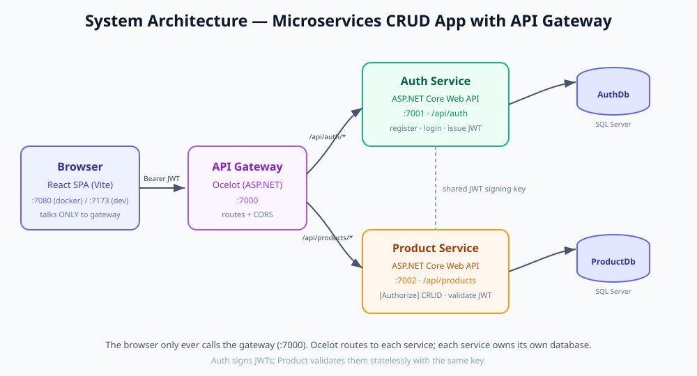
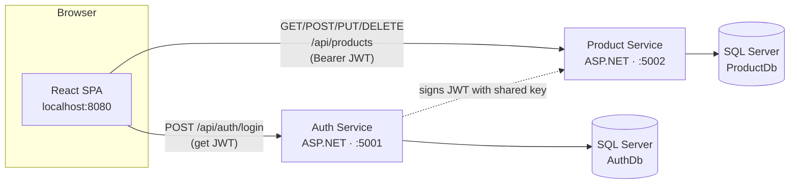
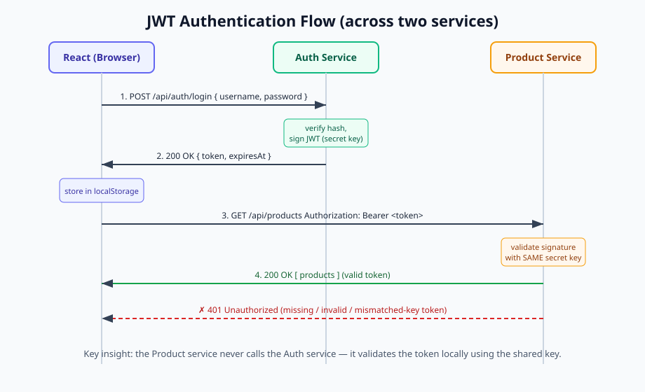
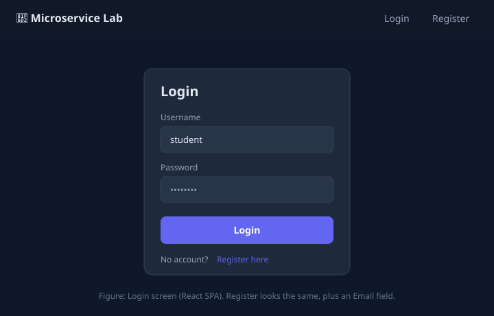
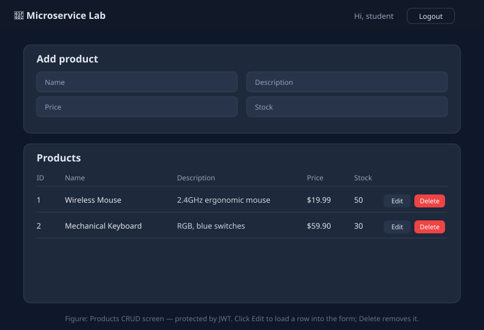
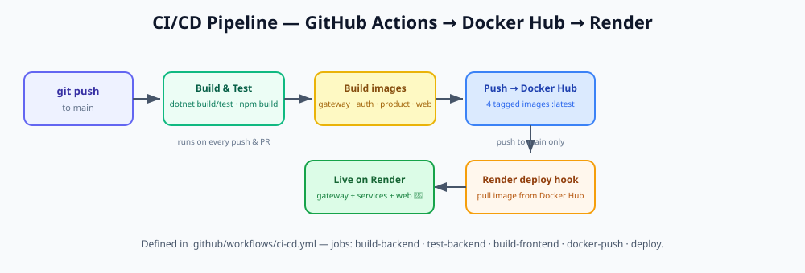

# Lab: Build a Microservices CRUD App with React, ASP.NET, SQL Server, Docker & CI/CD

> A complete, hands-on tutorial. You will build a small e‑commerce style app where
> users **register / log in** (Authentication microservice) and manage a list of
> **products** (CRUD microservice). The frontend is **React**, both backends are
> **ASP.NET Core Web APIs**, data lives in **SQL Server**, everything is packaged
> with **Docker**, wired to a **CI/CD** pipeline (GitHub Actions), and deployed to
> **Render**.

**Estimated time:** 3–4 hours · **Level:** Intermediate

---

## 📦 Companion materials (in this repo)

| Resource | Path | Use it for |
|----------|------|-----------|
| 🔌 API tests (REST Client) | [`requests/auth.http`](requests/auth.http), [`requests/products.http`](requests/products.http) | Test the APIs from VS Code |
| 📮 Postman collection | [`requests/MicroserviceLab.postman_collection.json`](requests/MicroserviceLab.postman_collection.json) | Import into Postman (auto-saves the token) |
| 🧪 Unit tests | [`services/AuthService.Tests`](services/AuthService.Tests), [`services/ProductService.Tests`](services/ProductService.Tests) | xUnit tests run in CI (`dotnet test`) |
| ☁️ Render env files | [`deploy/`](deploy) | Copy-paste env vars for each Render service |
| 🖼️ Diagrams & figures | [`docs/images/`](docs/images) | Architecture, JWT flow, UI mockups, CI/CD |

> Follow this README top to bottom.

---

## ⚡ Quick start (just run it)

Want to see the finished app before studying the code? With **Docker Desktop running**:

```bash
docker compose up --build
```

Wait ~1–2 minutes (first run), then open **http://localhost:8080**, register a user, and
manage products. That's the whole stack — SQL Server + both APIs + React — in one command.

To understand *how* it works and *how to deploy it yourself*, follow the parts below.

---

## Table of contents

1. [What you will build](#1-what-you-will-build)
2. [Learning objectives](#2-learning-objectives)
3. [Prerequisites & tools](#3-prerequisites--tools)
4. [Architecture overview](#4-architecture-overview)
5. [Project structure](#5-project-structure)
6. [Part A — Run SQL Server locally](#6-part-a--run-sql-server-locally)
7. [Part B — The Authentication service (ASP.NET)](#7-part-b--the-authentication-service-aspnet)
8. [Part C — The Product CRUD service (ASP.NET)](#8-part-c--the-product-crud-service-aspnet)
9. [Part D — The React frontend](#9-part-d--the-react-frontend)
10. [Part E — Run the full stack locally](#10-part-e--run-the-full-stack-locally)
11. [Part F — Dockerize everything (docker-compose)](#11-part-f--dockerize-everything-docker-compose)
12. [Part G — CI/CD with GitHub Actions](#12-part-g--cicd-with-github-actions)
13. [Part H — Deploy to Render](#13-part-h--deploy-to-render)
14. [Testing checklist](#14-testing-checklist)
15. [Troubleshooting](#15-troubleshooting)
16. [Key concepts glossary](#16-key-concepts-glossary)
17. [Submission checklist](#17-submission-checklist)

---

## 1. What you will build

A simple **Product Manager** web app:

- **Register / Login** — users create an account and sign in. On success they get a **JWT** (JSON Web Token).
- **Products CRUD** — logged-in users can **C**reate, **R**ead, **U**pdate and **D**elete products.
- The Product API is **protected**: it rejects requests that don't carry a valid JWT issued by the Auth service.

This is a **microservices** design: two independent backend services, each with its own database, plus a separate frontend.

---

## 2. Learning objectives

By the end of this lab you can:

- Explain the **microservices** pattern and the **database-per-service** rule.
- Build **REST APIs** in **ASP.NET Core** with **Entity Framework Core** and **SQL Server**.
- Implement **JWT authentication** in one service and **validate** those tokens in another.
- Build a **React** SPA that consumes multiple APIs and stores an auth token.
- Write **Dockerfiles** and orchestrate multiple containers with **docker-compose**.
- Create a **CI/CD pipeline** with **GitHub Actions**.
- **Deploy** containers and a static site to **Render**.

---

## 3. Prerequisites & tools

Install these before you start:

| Tool | Version | Check with |
|------|---------|------------|
| [.NET SDK](https://dotnet.microsoft.com/download) | 8.0+ | `dotnet --version` |
| [Node.js](https://nodejs.org) | 20+ | `node --version` |
| [Docker Desktop](https://www.docker.com/products/docker-desktop/) | latest | `docker --version` |
| [Git](https://git-scm.com/) | latest | `git --version` |
| A code editor | — | VS Code / Visual Studio / Rider |
| A [GitHub](https://github.com) account | — | for CI/CD |
| A [Render](https://render.com) account | — | for deployment (free) |

> 💡 **You don't need to install SQL Server manually** — we run it as a Docker container.

Optional but handy: the **REST Client** or **Thunder Client** VS Code extension, or **Postman**, to test APIs.

---

## 4. Architecture overview



<details>
<summary>Same diagram as Mermaid (renders on GitHub)</summary>


</details>

**How auth flows across services:**

1. User logs in → **Auth Service** signs a JWT using a secret **signing key**.
2. React stores the JWT in `localStorage`.
3. For every product request, React sends `Authorization: Bearer <jwt>`.
4. **Product Service** validates the JWT using the **same signing key** (no call back to Auth needed). This is *stateless* authentication — a core microservices idea.



> 🔑 **The single most important rule of this lab:** the `Jwt__Key`, `Jwt__Issuer`,
> and `Jwt__Audience` values **must be identical** in both services. If they differ,
> the Product service returns **401 Unauthorized**.

---

## 5. Project structure

```
Microservice_Docker_CICD/
├── README.md                     ← this tutorial
├── docker-compose.yml            ← runs the whole stack locally
├── render.yaml                   ← Render deployment blueprint
├── .github/workflows/ci-cd.yml   ← CI/CD pipeline
│
├── services/
│   ├── AuthService/              ← Microservice #2: Authentication (JWT)
│   │   ├── Controllers/AuthController.cs
│   │   ├── Data/AuthDbContext.cs
│   │   ├── DTOs/AuthDtos.cs
│   │   ├── Models/AppUser.cs
│   │   ├── Services/TokenService.cs, PasswordHasher.cs
│   │   ├── Program.cs
│   │   ├── appsettings.json
│   │   └── Dockerfile
│   ├── AuthService.Tests/        ← xUnit tests (hashing, token)
│   │
│   ├── ProductService/           ← Microservice #1: Products CRUD
│   │   ├── Controllers/ProductsController.cs
│   │   ├── Data/ProductDbContext.cs
│   │   ├── DTOs/ProductDtos.cs
│   │   ├── Models/Product.cs
│   │   ├── Program.cs
│   │   ├── appsettings.json
│   │   └── Dockerfile
│   └── ProductService.Tests/     ← xUnit tests (CRUD controller, in-memory DB)
│
├── deploy/                       ← Render env-var templates
├── requests/                     ← .http + Postman API tests
├── docs/                         ← images/
│
└── frontend/                     ← React (Vite) single-page app
    ├── src/
    │   ├── pages/ (Login, Register, Products)
    │   ├── context/AuthContext.jsx
    │   ├── api.js
    │   └── App.jsx
    ├── Dockerfile
    ├── nginx.conf
    └── package.json
```

> This repository already contains all the code. You can **read along** to
> understand each file, then **run** it. If you prefer to build from scratch,
> the sections below explain how each part was created and why.

---

## 6. Part A — Run SQL Server locally

We run Microsoft SQL Server 2022 as a Docker container. Open a terminal and run:

```bash
docker run -e "ACCEPT_EULA=Y" -e "MSSQL_SA_PASSWORD=Your_password123" -p 1433:1433 --name lab-sqlserver -d mcr.microsoft.com/mssql/server:2022-latest
```

Verify it's running:

```bash
docker ps
```

You should see `lab-sqlserver` in the list. SQL Server now listens on `localhost:1433`.

- **Username:** `sa`
- **Password:** `Your_password123` (the SA password rules: 8+ chars, upper, lower, digit)

> ⚠️ In the full stack (Part F) `docker-compose` starts SQL Server **for you**, so
> you only need this manual step when running the services directly with
> `dotnet run`. If you'll go straight to docker-compose, you can skip ahead.

The databases (`AuthDb`, `ProductDb`) do **not** exist yet — each service creates
its own on first startup via `db.Database.EnsureCreated()` (see `Program.cs`).

---

## 7. Part B — The Authentication service (ASP.NET)

Location: [`services/AuthService`](services/AuthService).

### 7.1 How it was created

```bash
# From the repo root (only if building from scratch):
dotnet new webapi -n AuthService -o services/AuthService --no-openapi
cd services/AuthService
dotnet add package Microsoft.EntityFrameworkCore.SqlServer
dotnet add package Microsoft.EntityFrameworkCore.Design
dotnet add package Microsoft.AspNetCore.Authentication.JwtBearer
dotnet add package System.IdentityModel.Tokens.Jwt
dotnet add package Swashbuckle.AspNetCore
```

### 7.2 The pieces

- **`Models/AppUser.cs`** — the user entity. We store a **password hash**, never the raw password.
- **`Data/AuthDbContext.cs`** — EF Core context; `Username` and `Email` are unique.
- **`DTOs/AuthDtos.cs`** — `RegisterDto`, `LoginDto`, and `AuthResponseDto` (what the client sends/receives).
- **`Services/TokenService.cs`** — builds and signs the **JWT**.
- **`Controllers/AuthController.cs`** — two endpoints:
  - `POST /api/auth/register`
  - `POST /api/auth/login`
- **`Program.cs`** — wires up EF Core, CORS, Swagger, and auto-creates the DB.

**Password security:** passwords are hashed with **PBKDF2** (100,000 iterations, random salt) and compared in constant time. Look at `HashPassword` / `VerifyPassword` in `AuthController.cs`.

### 7.3 Run and test it

```bash
cd services/AuthService
dotnet run --urls http://localhost:5001
```

Open Swagger at **http://localhost:5001/swagger** and try:

1. `POST /api/auth/register` with:
   ```json
   { "username": "student", "email": "student@lab.com", "password": "secret123" }
   ```
2. You get back a `token`. 🎉 That's your JWT — copy it, you'll need it for the Product API.

**Expected response (200 OK):**

```json
{
  "username": "student",
  "email": "student@lab.com",
  "token": "eyJhbGciOiJIUzI1NiIsInR5cCI6IkpXVCJ9...",
  "expiresAt": "2026-07-27T14:30:00Z"
}
```

> 🧪 Prefer testing outside the browser? Use [`requests/auth.http`](requests/auth.http)
> (VS Code REST Client) or the [Postman collection](requests/MicroserviceLab.postman_collection.json).
> Paste the `token` into [jwt.io](https://jwt.io) to see the readable claims inside it.

> ✅ **Checkpoint 1:** register + login both return a `token`. If you get **409**, that
> username/email is already taken — pick another.

---

## 8. Part C — The Product CRUD service (ASP.NET)

Location: [`services/ProductService`](services/ProductService).

### 8.1 How it was created

```bash
dotnet new webapi -n ProductService -o services/ProductService --no-openapi
cd services/ProductService
dotnet add package Microsoft.EntityFrameworkCore.SqlServer
dotnet add package Microsoft.EntityFrameworkCore.Design
dotnet add package Microsoft.AspNetCore.Authentication.JwtBearer
dotnet add package Swashbuckle.AspNetCore
```

### 8.2 The pieces

- **`Models/Product.cs`** — the product entity (`Name`, `Description`, `Price`, `Stock`).
- **`Data/ProductDbContext.cs`** — EF context; also **seeds** two sample products.
- **`Controllers/ProductsController.cs`** — full CRUD. Note the **`[Authorize]`** attribute on the class: every endpoint requires a valid JWT.
- **`Program.cs`** — configures **JWT validation** with `AddJwtBearer(...)`. The
  `ValidIssuer`, `ValidAudience`, and `IssuerSigningKey` must match the Auth service.

### 8.3 Run and test it

Keep the Auth service running, and in a **second terminal**:

```bash
cd services/ProductService
dotnet run --urls http://localhost:5002
```

Open **http://localhost:5002/swagger**:

1. Call `GET /api/products` **without** a token → **401 Unauthorized**. Good — it's protected.
2. Click **Authorize** (top right), paste the JWT from Part B, and authorize.
3. Call `GET /api/products` again → **200 OK** with the two seeded products.
4. Try `POST`, `PUT`, `DELETE`. This is your CRUD in action.

**Expected `GET /api/products` response (200 OK, after Authorize):**

```json
[
  { "id": 2, "name": "Mechanical Keyboard", "description": "RGB, blue switches", "price": 59.90, "stock": 30, "createdAt": "2024-01-01T00:00:00" },
  { "id": 1, "name": "Wireless Mouse", "description": "2.4GHz ergonomic mouse", "price": 19.99, "stock": 50, "createdAt": "2024-01-01T00:00:00" }
]
```

> 🧪 Full CRUD script: [`requests/products.http`](requests/products.http). It logs in,
> then creates → reads → updates → deletes a product.

> ✅ **Checkpoint 2 (the "aha" moment):** the same `GET /api/products` returns **401**
> without a token and **200** with a valid token. That proves the JWT issued by the Auth
> service is trusted by the Product service — the heart of this lab.

---

## 9. Part D — The React frontend

Location: [`frontend`](frontend).

### 9.1 How it was created

```bash
npm create vite@latest frontend -- --template react
cd frontend
npm install
npm install react-router-dom
```

### 9.2 The pieces

- **`src/api.js`** — a small `fetch` wrapper. It reads the API URLs from
  `VITE_AUTH_API_URL` / `VITE_PRODUCT_API_URL` and automatically attaches the
  `Authorization: Bearer <token>` header for product calls.
- **`src/context/AuthContext.jsx`** — stores the logged-in user + token in
  `localStorage` and exposes `login()` / `logout()`.
- **`src/pages/Login.jsx`, `Register.jsx`** — auth forms.
- **`src/pages/Products.jsx`** — the CRUD table + add/edit form.
- **`src/App.jsx`** — routing; `ProtectedRoute` redirects to `/login` if not authenticated.

### 9.3 Configure and run

The frontend reads its config from `frontend/.env`:

```bash
VITE_AUTH_API_URL=http://localhost:5001
VITE_PRODUCT_API_URL=http://localhost:5002
```

Start the dev server:

```bash
cd frontend
npm install
npm run dev
```

Open **http://localhost:5173**. Register a user, then add/edit/delete products.

| Login / Register | Products (CRUD) |
|:---:|:---:|
|  |  |

> ✅ **Checkpoint 3:** you can register in the browser, get redirected into the app, see
> the two seeded products, and add/edit/delete rows that persist after a page refresh.

> 🧠 **CORS note:** browsers block cross-origin API calls unless the API allows them.
> Both services enable CORS for `http://localhost:5173` (dev) and `http://localhost:8080`
> (docker) via the `AllowedOrigins` setting. If you see a CORS error, that's the knob to check.

---

## 10. Part E — Run the full stack locally

To run **without Docker**, you need three terminals + SQL Server:

| Terminal | Command | URL |
|----------|---------|-----|
| SQL Server | `docker run ... mssql/server` (Part A) | `localhost:1433` |
| Auth | `dotnet run --urls http://localhost:5001` | http://localhost:5001/swagger |
| Product | `dotnet run --urls http://localhost:5002` | http://localhost:5002/swagger |
| Frontend | `npm run dev` | http://localhost:5173 |

Once you've confirmed it works, the easier path is one command with Docker → next part.

### 10.1 Run the automated tests

The project ships with **xUnit** tests. They need **no database** (the Product tests use
an in-memory EF provider), so you can run them any time:

```bash
dotnet test services/AuthService.Tests/AuthService.Tests.csproj
dotnet test services/ProductService.Tests/ProductService.Tests.csproj
```

- **AuthService.Tests** — password hashing (hash ≠ plaintext, verify true/false, random salt) and JWT claims.
- **ProductService.Tests** — the CRUD controller: list seeded products, create, update, delete, not-found.

These same tests run automatically in CI (Part G).

---

## 11. Part F — Dockerize everything (docker-compose)

Each service has a **multi-stage Dockerfile**: a *build* stage compiles the app, and a
smaller *runtime* stage runs it. This keeps images small and fast.

- `services/AuthService/Dockerfile` & `services/ProductService/Dockerfile` — .NET SDK → ASP.NET runtime.
- `frontend/Dockerfile` — Node builds the static bundle → **nginx** serves it.

The **`docker-compose.yml`** at the repo root ties it all together: SQL Server + both
APIs + frontend, on one network, with the right environment variables.

### Run the whole app with one command

From the repo root:

```bash
docker compose up --build
```

Wait for the images to build and SQL Server to become healthy (~1–2 min the first time). Then open:

- **Frontend:** http://localhost:8080
- **Auth Swagger:** http://localhost:5001/swagger
- **Product Swagger:** http://localhost:5002/swagger

Stop everything with `Ctrl+C`, then:

```bash
docker compose down
```

> 🔎 **Two networking details worth understanding:**
> 1. Inside the compose network, services reach the DB at host **`sqlserver`** (the
>    service name), not `localhost`. That's why the compose connection strings say
>    `Server=sqlserver,1433`.
> 2. The **browser** runs on your host, so the React bundle is built with
>    `VITE_*_API_URL=http://localhost:5001/5002` (the published ports), passed as
>    Docker **build args** in `docker-compose.yml`.

---

## 12. Part G — CI/CD with GitHub Actions

**CI/CD** = *Continuous Integration / Continuous Deployment*. On every push, a robot
builds your code, verifies it compiles, builds the Docker images, and (on `main`)
triggers a deploy. The pipeline lives in
[`.github/workflows/ci-cd.yml`](.github/workflows/ci-cd.yml).



It has four jobs:

1. **build-backend** — restores & builds both .NET services (matrix build).
2. **build-frontend** — installs deps & runs `npm run build`.
3. **docker-build** — builds all three Docker images to prove the Dockerfiles are valid.
4. **deploy** — on push to `main`, calls Render **Deploy Hooks** to ship the new version.

### Push the project to GitHub

```bash
cd Microservice_Docker_CICD
git init
git add .
git commit -m "Initial microservices lab"
git branch -M main
git remote add origin https://github.com/<your-username>/<your-repo>.git
git push -u origin main
```

Go to your repo's **Actions** tab — you'll see the pipeline run. The `deploy` job
needs three secrets (added after Part H): `RENDER_DEPLOY_HOOK_AUTH`,
`RENDER_DEPLOY_HOOK_PRODUCT`, `RENDER_DEPLOY_HOOK_FRONTEND`. Until then it will
simply fail the last job — that's expected.

> Add secrets under **Settings → Secrets and variables → Actions → New repository secret**.

---

## 13. Part H — Deploy to Render

Render can build Docker services and static sites straight from your GitHub repo.

### 13.1 The database (keeping SQL Server)

Render's free tier does **not** host SQL Server, so we host the database elsewhere and
give Render only the connection string. Recommended free option: **Azure SQL Database
(free offer)**.

1. Create a free Azure SQL Database (Azure Portal → *SQL databases* → *Create* → pick
   the **Free** service tier / free offer).
2. Allow public network access and add a firewall rule to permit Azure/other services.
3. Copy its **ADO.NET connection string**. It looks like:
   ```
   Server=tcp:yourserver.database.windows.net,1433;Initial Catalog=labdb;User ID=sqladmin;Password=YOUR_PASSWORD;Encrypt=True;TrustServerCertificate=False;
   ```

> Prefer to stay 100% on Render's free tier instead? See
> [Appendix: deploying with PostgreSQL](#appendix-alternative-deploy-with-postgresql).

### 13.2 Deploy the two ASP.NET services (Docker web services)

For **each** service (Auth, then Product):

1. Render dashboard → **New → Web Service** → connect your GitHub repo.
2. **Runtime:** Docker.
3. **Root Directory / Dockerfile path:**
   - Auth → `services/AuthService`
   - Product → `services/ProductService`
4. **Instance type:** Free.
5. **Environment variables:**

   | Key | Auth service | Product service |
   |-----|--------------|-----------------|
   | `ConnectionStrings__DefaultConnection` | your SQL Server conn string | your SQL Server conn string |
   | `Jwt__Key` | a long random secret (32+ chars) | **the exact same value** |
   | `Jwt__Issuer` | `MicroserviceLab` | `MicroserviceLab` |
   | `Jwt__Audience` | `MicroserviceLabClients` | `MicroserviceLabClients` |
   | `AllowedOrigins` | *(set in 13.4)* | *(set in 13.4)* |

6. Click **Create Web Service**. Render builds the image and gives you a public URL like
   `https://lab-authservice.onrender.com`. Verify `/<url>/health` returns `healthy`.

> 📋 **Shortcut for the env vars:** the [`deploy/`](deploy) folder has copy-paste
> templates — [`render.authservice.env.example`](deploy/render.authservice.env.example),
> [`render.productservice.env.example`](deploy/render.productservice.env.example),
> [`render.frontend.env.example`](deploy/render.frontend.env.example). In Render:
> **Environment → Add from .env → paste**, then replace the `<PLACEHOLDER>`s.

> 💡 Or use the included **`render.yaml`** blueprint: Render dashboard →
> **New → Blueprint** → select your repo. It provisions all three services; you then
> fill the `sync:false` env vars in the dashboard.

### 13.3 Deploy the React frontend (static site)

1. Render dashboard → **New → Static Site** → same repo.
2. **Root Directory:** `frontend`
3. **Build Command:** `npm install && npm run build`
4. **Publish Directory:** `dist`
5. **Environment variables** (these are read at build time):
   - `VITE_AUTH_API_URL` = your deployed auth URL, e.g. `https://lab-authservice.onrender.com`
   - `VITE_PRODUCT_API_URL` = your deployed product URL, e.g. `https://lab-productservice.onrender.com`
6. Create it. You get a URL like `https://lab-frontend.onrender.com`.

### 13.4 Wire up CORS

Now that you know the frontend URL, set `AllowedOrigins` on **both** ASP.NET services
to that URL (e.g. `https://lab-frontend.onrender.com`) and let them redeploy. Otherwise
the browser will block the API calls.

### 13.5 Connect CI/CD to Render

For each Render service: **Settings → Deploy Hook** → copy the URL. Add the three URLs
as GitHub secrets (Part G). Now every push to `main` auto-deploys. 🚀

> ⏱️ **Free tier note:** free Render services *sleep* after inactivity, so the first
> request after a while can take ~30–60s to wake up. That's normal.

---

## 14. Testing checklist

Run through this end-to-end (locally and/or on Render):

- [ ] Register a new user → redirected into the app.
- [ ] Log out, then log back in → works.
- [ ] Log in with a wrong password → clear "Invalid username or password" error.
- [ ] See the two seeded products.
- [ ] **Create** a product → appears in the table.
- [ ] **Edit** a product → changes persist after refresh.
- [ ] **Delete** a product → row disappears.
- [ ] Open the Product Swagger and call `GET /api/products` with no token → **401**.
- [ ] Both `/health` endpoints return `healthy`.

---

## 15. Troubleshooting

| Symptom | Likely cause | Fix |
|--------|--------------|-----|
| Product API always returns **401** even when logged in | `Jwt__Key`/`Issuer`/`Audience` differ between services | Make all three identical in both services |
| **CORS error** in the browser console | Frontend URL not in `AllowedOrigins` | Add the exact frontend origin to both services and redeploy |
| Service crashes on startup with a SQL error | DB not ready / wrong connection string | Check the connection string; compose uses host `sqlserver`, local uses `localhost` |
| `docker compose up` hangs on SQL Server | It's still initializing | Wait for the healthcheck; first run is slow |
| Login works but products won't load | Wrong `VITE_PRODUCT_API_URL` | Fix the frontend env var and rebuild (Vite bakes it at build time) |
| Render build fails | Wrong Dockerfile path / root dir | Re-check the paths in 13.2 |
| Changes to `.env` don't show up | Vite only reads env at build time | Restart `npm run dev`, or rebuild the image |

---

## 16. Key concepts glossary

- **Microservice** — a small, independently deployable service that owns one business capability.
- **Database-per-service** — each microservice has its own database; services never share tables.
- **REST API** — HTTP endpoints using verbs (GET/POST/PUT/DELETE) over resources.
- **DTO** — Data Transfer Object; the shape of data crossing the API boundary (decoupled from DB entities).
- **EF Core** — Entity Framework Core, .NET's ORM for talking to databases with C# objects.
- **JWT** — a signed token proving who a user is; validated with a shared key, no DB lookup needed.
- **CORS** — browser security that controls which web origins may call an API.
- **Docker image / container** — a packaged app + its dependencies (image), and a running instance (container).
- **Multi-stage build** — a Dockerfile that builds in one image and copies only the result into a lean runtime image.
- **CI/CD** — automated build/test (CI) and release (CD) triggered by code pushes.

---

## 17. Submission checklist

- [ ] Public GitHub repo with all code and a green (or explained) Actions run.
- [ ] `docker compose up --build` runs the full stack locally.
- [ ] Live frontend URL on Render, backed by both live services.
- [ ] Short write-up (or screenshots) showing register → login → CRUD working.
- [ ] Confirm `Jwt__*` values match across services and CORS is configured.

---

## Appendix: alternative — deploy with PostgreSQL

If you want to stay entirely on Render's free tier (no external SQL Server), you can
swap the database provider to Render's free **PostgreSQL**. It's a tiny change:

1. In each service, replace the NuGet package `Microsoft.EntityFrameworkCore.SqlServer`
   with `Npgsql.EntityFrameworkCore.PostgreSQL`.
2. In each `Program.cs`, change `options.UseSqlServer(...)` to `options.UseNpgsql(...)`.
3. In `render.yaml`, add a `databases:` block and bind
   `ConnectionStrings__DefaultConnection` via `fromDatabase`.

Everything else (controllers, JWT, React, Docker, CI/CD) stays the same — that's one of
the benefits of using an ORM. Keep SQL Server for local dev and Postgres for the free
cloud deploy, or standardize on one.

---

### 🎓 You're done!

You built a real microservices application: two ASP.NET services with separate SQL
Server databases, JWT auth across service boundaries, a React frontend, full Docker
packaging, a CI/CD pipeline, and a cloud deployment. Nicely done.
